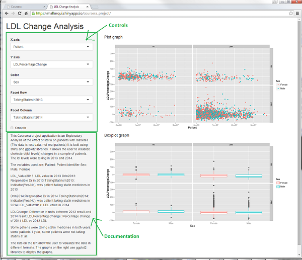
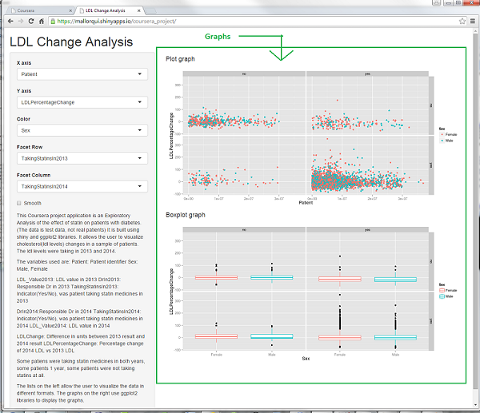
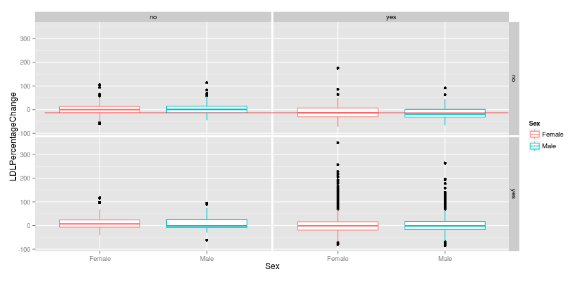

## Statin shiny app

Shiny app for statin use Exploratory Analysis

---

## Introduction
<h4 align="center">
- This Coursera project application is an Exploratory Analysis of the effect of statin on diabetic patients.</h4>
<p>
<h4 align="center">- The data is test data, not real patients.</h4>
<p>
<h4 align="center">- It is trying to answer the question: Are statin medicines helping our patients decrease their cholesterol levels?</h4>
<p>
<h4 align="center">- It is built using shiny and ggplot2 libraries.</h4>
<p>
<h4 align="center">- It allows the user to visualize cholesterol(ldl levels) changes in a sample of patients.</h4>
<p>
<h4 align="center">- The ldl levels were taken in January 2013 and December 2014.
</h4>


--- 

## Control Inputs

<h3 align="center">Controls and documentation are on left side of the webpage</h4>
<h3 align="center"></h3>

--- 

## Graph outputs

<h3 align="center">Graphs with visual representation are on the right panel.</h4>
<h3 align="center"></h3>

--- 

## Calculations

<h4 align="center">The ldl change and ldl percentage change were pre-calculated.
These are the formulas used.</h4>


```r
ldl <- read.csv("ldl_change.csv",sep='|')
(ldl[1,"LDL_Value2014"]
  - ldl[1,"LDL_Value2013"])
```

```
## [1] -4
```

```r
((ldl[1,"LDL_Value2014"] 
  - ldl[1,"LDL_Value2013"])
 /ldl[1,"LDL_Value2013"])*100
```

```
## [1] -4.347826
```


--- 

## Utility of this application

Tool can be used to visualy see how patients that were not taking statins in 2013 but started taking them in 2014 have a negative change in LDL levels, so their cholesterol levels have decreased.



Next step would be to statistically prove it.


